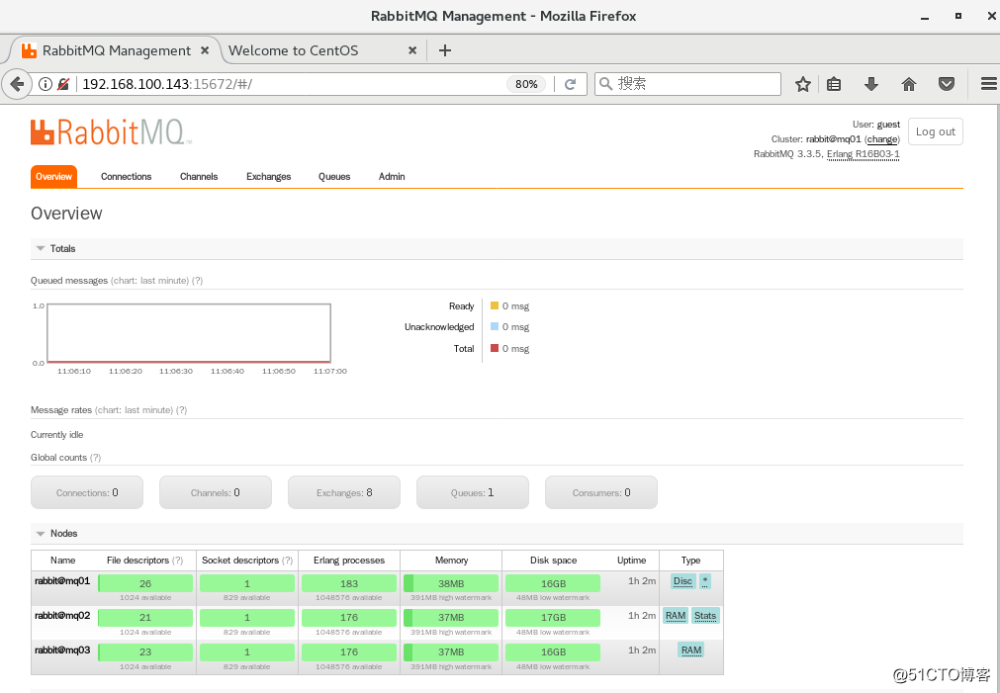
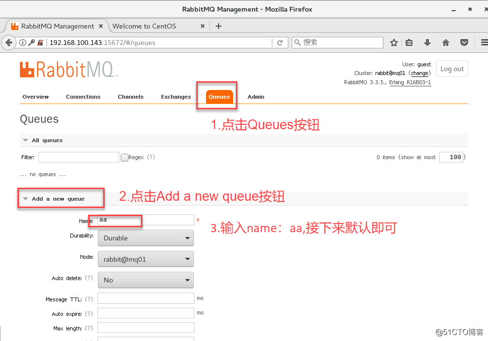
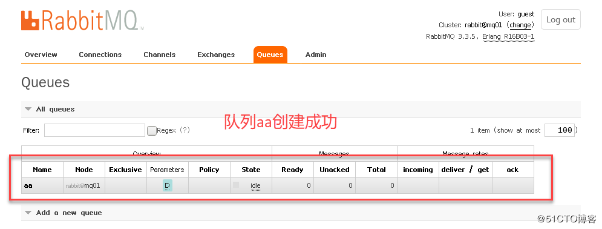
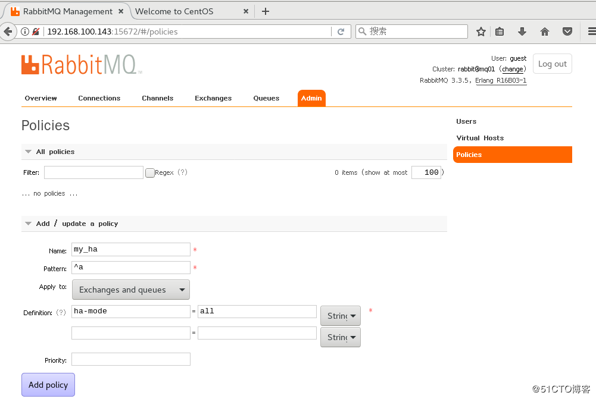
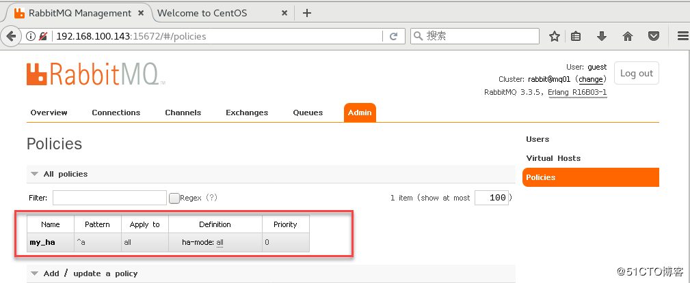
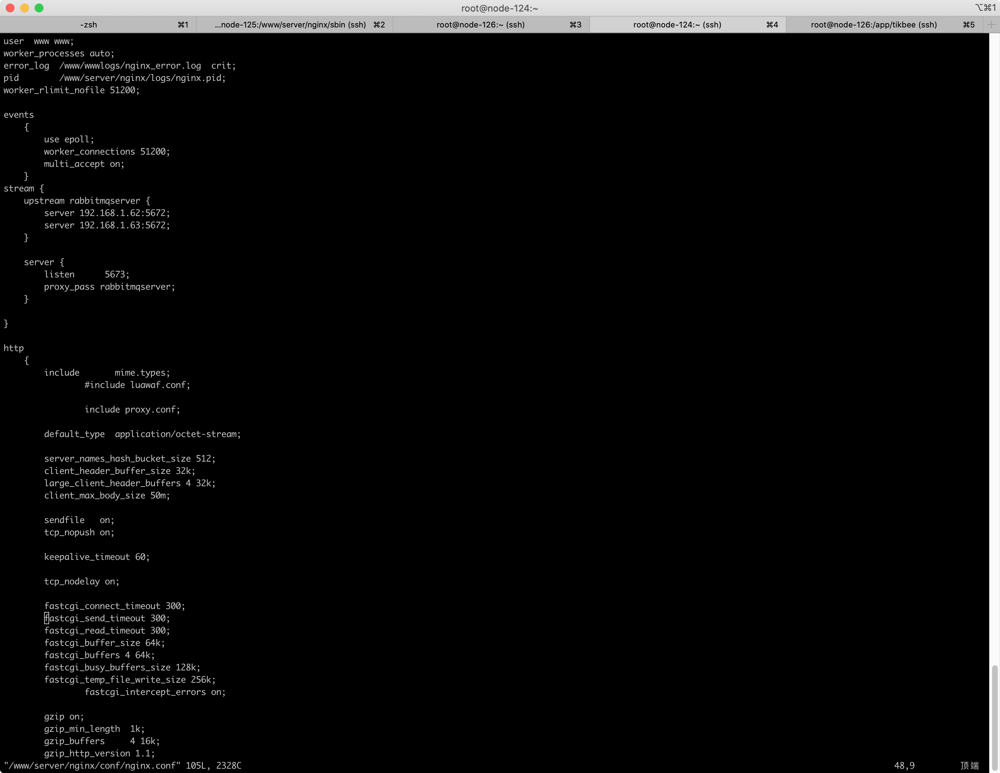

# RabbitMQ集群搭建

## RabbitMQ模式大概分为以下三种：

- 单一模式
- 普通模式（默认设置的集群模式）
- 镜像模式（把需要的队列做成镜像队列，存在多个节点，属于RabbitMQ的HA方案，在对业务的可靠性要求性较高的场合中比较适用）

要实现镜像模式，需要搭建一个普通的集群模式，在这个集群的基础上再配置镜像模式已实现高可用

## RabbitMQ特点

RabbitMQ集群节点包括内存节点、磁盘节点。RabbitMQ支持消息持久化。有就是写在磁盘上，最合适的方案就是既有内存节点又有磁盘节点。

## 环境

|IP地址|主机名|操作系统|防火墙和SELinux|用途|
|---|---|---|---|---|--|--|---|
|192.168.1.61|node-124|CentOS8|开启5762，15672端口|磁盘节点|
|192.168.1.62|node-125|CentOS8|开启5762，15672端口|磁盘节点|
|192.168.1.63|node-126|CentOS8|开启5762，15672端口|磁盘节点|
|192.168.1.61|node-124|CentOS8|开启5763|Nginx节点，分发|

注意，三台服务器应该都连上互联网，在同一网段类

## RabbitMQ普通集群配置

> 这里使用的是RabbitMQ版本是3.8.9，Nginx版本1.9以上，需要stream模块

### 1. 配置host文件

更改三台MQ节点的计算机名分别为node-124，node-125，node-126，然后修改host配置文件

```shell
vim /etc/hostname
node-124.localdomain

vim /etc/hosts
192.168.1.61 node-124
192.168.1.62 node-125
192.168.1.63 node-126
```

### 2. 三个节点配置yum源，安装RabbitMQ软件

```shell
yum install -y epel-release

yum install -y rabbitmq-serve
```

### 3. 拷贝elrang.cookie

RabbitMQ的集群是依附erlang的集群来工作的，所以必须构建起erlang的集群。Erlang的集群中各个节点是经由一个magic cookie来实现的，这个cookie存放在/var/lib/rabbitmq/.erlang.cookie中，文件是400权限，必须保证各个节点的cookie一致，不然无法通信

```
cat /var/lib/rabbitmq/.erlang.cookie
BVLLUXGSPEIGRBQCAMEU
```

用scp的方式将node-124节点的.erlang.cookie的值复制到其他两个节点中

```shell
scp /var/lib/rabbitmq/.erlang.cookie root@node-125:/var/lib/rabbitmq/.erlang.cookie

scp /var/lib/rabbitmq/.erlang.cookie root@node-126:/var/lib/rabbitmq/.erlang.cookie
```

### 4. 分别查看三个节点并添加管理服务，最后启动RabbitMQ服务

RabbitMQ提供了一个非常友好的图形化监控页面插件（rabbitmq_management），让我们可以一目了然的看见RabbitMQ的状态和集群状态。

```shell
/usr/lib/rabbitmq/bin/rabbitmq-plugins list //查看插件安装情况

/usr/lib/rabbitmq/bin/rabbitmq-plugins enable rabbitmq_management //启用rabbitmq_management服务

service rabbitmq-server start
```

### 5. 查看监听端口（插件监控的端口是15672）

```shell
[root@node-124 ~]# netstat -ntap | grep 5672
tcp        0      0 0.0.0.0:25672           0.0.0.0:*               LISTEN      2256/beam.smp
tcp        0      0 0.0.0.0:15672           0.0.0.0:*               LISTEN      2256/beam.smp
tcp6       0      0 :::5672                 :::*                    LISTEN      2256/beam.smp
```

### 6. 将node-125，node-126作为内存节点加入node-124节点集群中

在node-125，node-126执行如下命令：

```
rabbitmqctl stop_app    //停掉rabbit应用

rabbitmqctl join_cluster --ram rabbit@node-124 //加入到磁盘节点

rabbitmqctl start_app  //启动rabbit应用
```

> 1. 默认rabbitmq启动后是磁盘节点，在这个cluster命令下，mq02和mq03是内存节点，mq01是磁盘节点。
> 2. 如果要使mq02、mq03都是磁盘节点，去掉--ram参数即可。
> 3. 如果想要更改节点类型，可以使用命令rabbitmqctl change_cluster_node_type disc(ram),前提是必须停掉rabbit应用

### 7. 查看集群状态

```shell
[root@node-124 ~]#rabbitmqctl cluster_status

Cluster status of node rabbit@node-124 ...
Basics

Cluster name: rabbit@node-124

Disk Nodes

rabbit@node-124

RAM Nodes

rabbit@node-125
rabbit@node-126

Running Nodes

rabbit@node-124
rabbit@node-125
rabbit@node-126
```

### 8. 登录RabbitMQ Web管理控制台，创建新的队列

打开浏览器输入http://192.168.1.61:15672, 输入默认的Username：guest，输入默认的Password:guest ,登录后出现如图所示的界面。



根据界面提示创建一条队列





> 在RabbitMQ集群集群中，必须至少有一个磁盘节点，否则队列元数据无法写入到集群中，当磁盘节点宕掉时，集群将无法写入新的队列元数据信息。

## RabbitMQ镜像集群配置

> 上面已经完成RabbitMQ默认集群模式，但并不保证队列的高可用性，尽管交换机、绑定这些可以复制到集群里的任何一个节点，但是队列内容不会复制。虽然该模式解决一项目组节点压力，但队列节点宕机直接导致该队列无法应用，只能等待重启，所以要想在队列节点宕机或故障也能正常应用，就要复制队列内容到集群里的每个节点，必须要创建镜像队列。
> 
> 镜像队列是基于普通的集群模式的，然后再添加一些策略，所以你还是得先配置普通集群，然后才能设置镜像队列，我们就以上面的集群接着做。

**设置的镜像队列可以通过开启的网页的管理端，也可以通过命令，这里说的是其中的网页设置方式。**

### 1. 创建RabbitMQ策略

1. 点击admin菜单->右侧的Policies选项->左侧最下下边的的Add/update a policy.
2. 安装图中的的内容根据自己的需求填写



> - Name:策略名称
> - Pattern：匹配的规则，这里表示匹配a开头的队列，如果是匹配所有的队列，那就是^.
> - Definition:使用ha-mode模式中的all，也就是同步所有匹配的队列。问号链接帮助文档。

3. 点击Add policy添加策略



至此，mq镜像集群创建完成

## Nginx负载分发

> 使用Nginx分别代理两个磁盘节点，实现MQ的高负载

配置文件如下

```conf
stream {
    upstream rabbitmqserver {
        server 192.168.1.62:5672;
        server 192.168.1.63:5672;
    }

    server {
        listen      5673;
        proxy_pass rabbitmqserver;
    }

}
```


